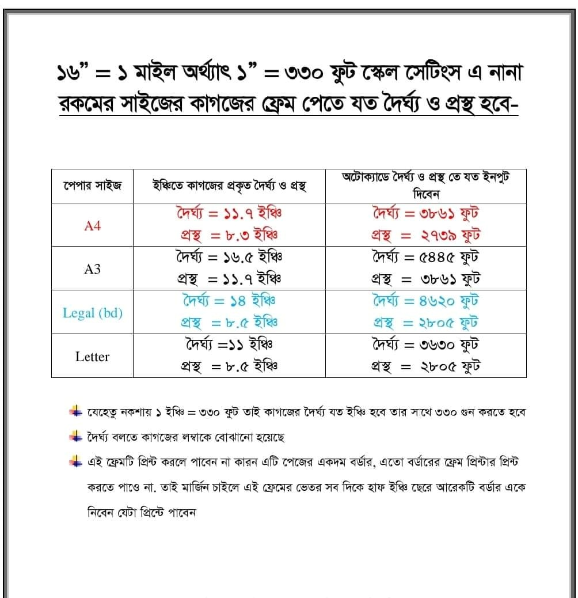
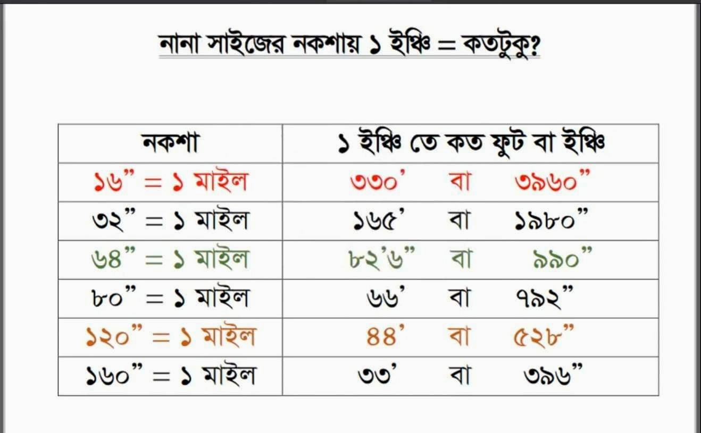

# noksa-scall in pageliar in Gnacad

## noska-scall in 16 and Gnacad

## র্দৈঘ থে‌কে ১০' এবং প্রস্থ থে‌কে ১০' বি‌য়োগ কর‌তে হ‌বে তাহ‌লে মার‌জিন ঠিক থাক‌বে।

# ম্যাপ স্কেল ঠিক করা।

#### ৬৬০' লাইন টান্তে হবে, (২) সম্পূর্ন ম্যাপ সিলেট করতে হবে। (৩)AL +Enter দিয়ে ১ম ম্যপ পয়েন্ট ২ লাইন পয়েন্ট।

## PDF converd JPG :-

https://pdf2jpg.net

